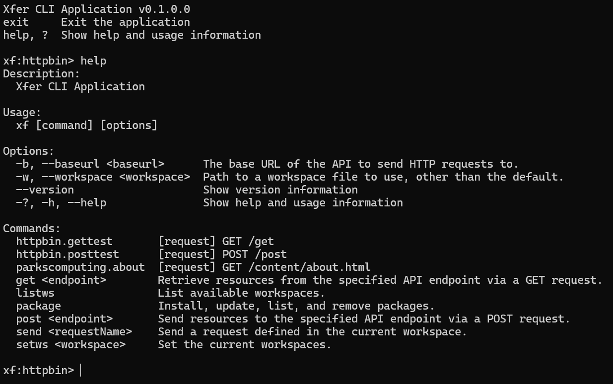

# The Xfer API-Management CLI Tool


The Xfer CLI tool provides a command-line interface (CLI) for making HTTP requests, scripting workflows, and easily interacting with APIs from the command line.

This repository was originally the home for the [Xfer data-transfer language](https://github.com/paulmooreparks/Xfer/blob/master/ParksComputing.Xfer.Lang). That project still exists, but I'm now using XferLang to implement the configuration for the Xfer CLI tool as well as for some internal data transfer tasks. The [core language specification](ParksComputing.Xfer.Lang/README.md) has moved into the folder that contains the assembly for the language implementation.

The Xfer CLI tool uses the [Cliffer CLI Library](https://github.com/paulmooreparks/Cliffer), another project I own, to implement the CLI interface.

## Motivation

Like most people who write and work with RESTful APIs, I've mainly used Postman and curl to test and otherwise interact with API endpoints. Early on in my current contract project, I wrote a powerful CLI tool in C# to let me call some of the more common endpoints that I needed as part of my daily work. While it is a very useful tool that I use constantly in my work, it's highly specialized, and now that I'm working on some other projects of my own I find myself wanting that same kind of tool for new APIs. That's why I decided to generalize the tool and make it available to others.

## Features

Here are some of the features of the Xfer CLI tool:

- **HTTP Interaction**: Call HTTP methods (GET, HEAD, POST, PUT, DELETE, OPTIONS, TRACE, PATCH) over HTTP and HTTPS. Set or modify headers, query parameters, and request bodies.
- **Workspaces**: Define workspaces (similar to Postman collections) to encapsulate related API interactions.
- **Derived Workspaces**: Create new workspaces by deriving from existing workspaces. This allows you to create a new workspace that is a copy of an existing workspace, but with some changes.
- **Environment Variables**: Pass and store values in the environment.
- **Scripting**: Pre-process requests, post-process responses, automate workflows, configure your environment, and MUCH more using JavaScript.
- **Object Model**: Define and use objects in the environment for passing, storing, and manipulating values from script.
- **Nuget Package Management**: Install Nuget packages and use them from JavaScript to extend the functionality of the tool.
- **REPL Mode**: The tool may be used in REPL mode (Read/Eval/Print Loop) or as a traditional command-line tool.

More is waiting to be documented, and even more is waiting to be implemented.



## Sample Configuration

When you run the tool for the first time (`xf` at the command line), it will create a `.xf` folder in your home directory ($HOME on Unix-like systems, %USERPROFILE% on Windows). In that folder, you can create the following configuration files:

- [`workspaces.xfer`](.xf/workspaces.xfer): Defines the workspace structure, the requests in each workspace, and blocks of JavaScript code that can be executed in conjunction with the workspace or request.
- [`store.xfer`](.xf/store.xfer): Defines key/value pairs that can be used in the workspace and request definitions. These may be updated by scripts or commands.
- [`.env`](.xf/.env): Defines environment variables that can be used in the workspace and request definitions.

Script files may also be placed in '.xf', and they can be referenced from the workspace or request definitions.

```xfer
</ Your workspace may reference external script like this. />
InitScript <'file:globalInitScript.js'>
```

If the file is in the `.xf` folder, the script engine will load it and execute the contents. The file path may also be fully specified if you wish to store it elsewhere.

Nuget packages installed with the `package` command are stored in the `.xf/packages` folder.

## But... Why?

Because Postman is too pointy-clicky and curl is too low-level. I want something in a sweet spot in between that lets me work with APIs at a higher level of abstraction, as if they were just another command on the command line, while still giving me the power to script and automate workflows.

